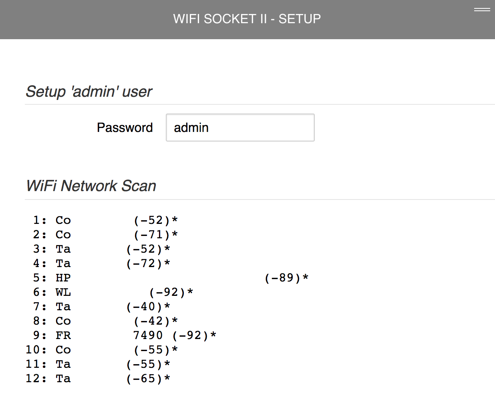
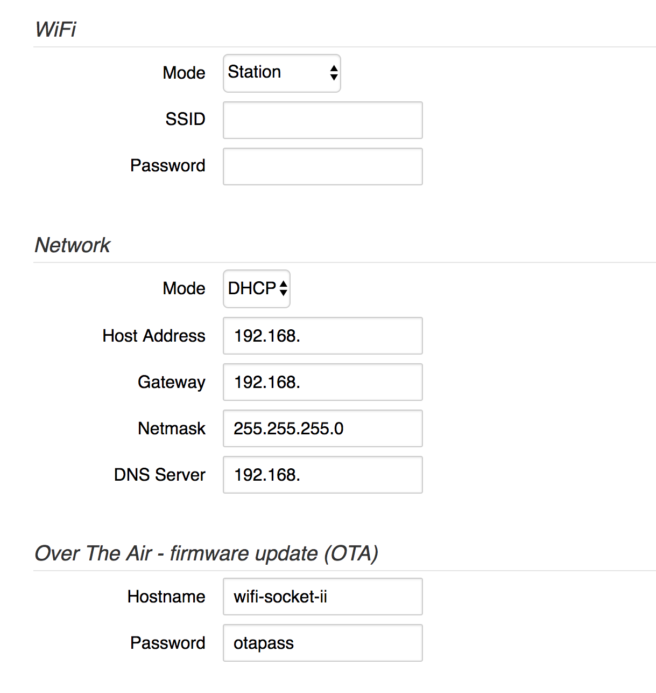
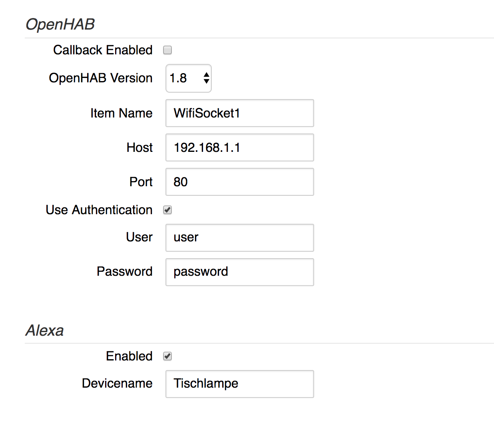
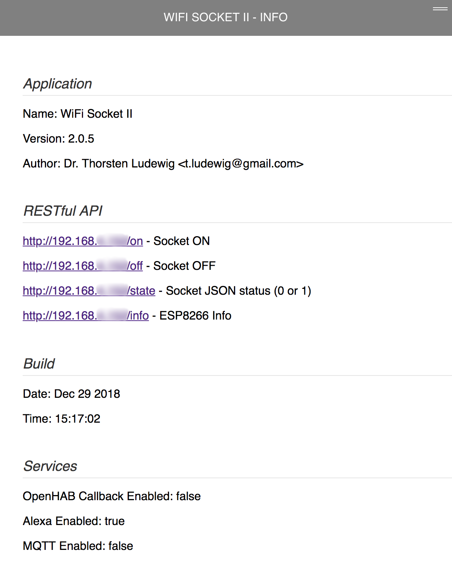

# Documentation

## Pins for flashing the ESP-WROOM-02

In my opinion the back side is easier to access the needed pins

## Screenshots

### Home Page

Top right menu button pressed

### Setup Page

### Info Page

